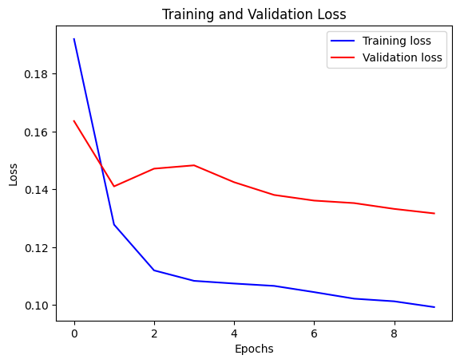
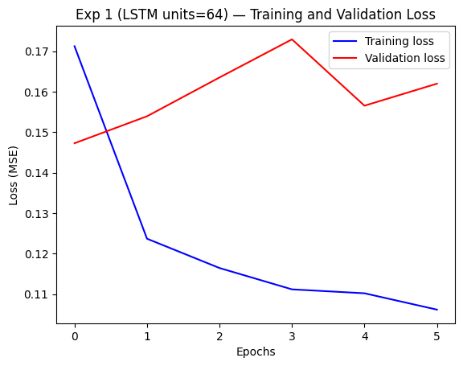
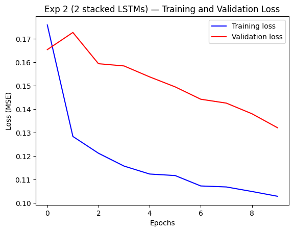
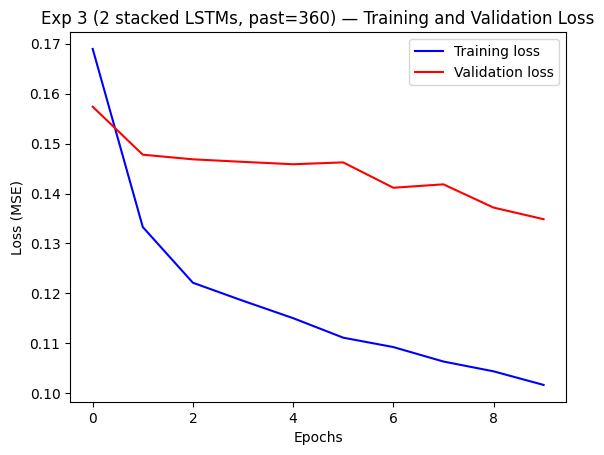

# Time Series Modelling with Deep Learning: Transformer Classification & LSTM Forecasting

## Project Overview

This project follows **CMPE 401 Instructor-defined Project 2** (see [`CMPE 401-Instructor-defined Project 2.pdf`](CMPE%20401-Instructor-defined%20Project%202.pdf) in this repository). It explores deep learning for time series: **Task 1** reproduces two official Keras baselines (LSTM forecasting and Transformer classification), and **Task 2** applies three incremental architectural changes to the LSTM forecaster on the Jena Climate dataset, with results and written discussion documented below and in [`results.md`](results.md) and [`discussion.md`](discussion.md).

---

## Reproducing this project (Google Colab)

These notebooks were run in **Google Colab**. You do not need a local GPU to reproduce the workflows; a Colab **CPU** runtime is enough for the baselines at modest epoch counts, though a **GPU** runtime speeds up training.

1. **Get the notebooks**  
   - Clone this repository or download the `.ipynb` files from GitHub, **or**  
   - In Colab: **File -> Upload notebook** and select the file from your machine.

2. **Open the notebook** and set the runtime (**Runtime -> Change runtime type**). Choose **GPU** if you want faster training (recommended for the Transformer and longer LSTM runs).

3. **Run in order**  
   - **Task 1 — FordA Transformer:** [`timeseries_classification_transformer.ipynb`](timeseries_classification_transformer.ipynb) - runs end to end; data is fetched inside the notebook as in the Keras example.  
   - **Task 1 — Jena LSTM:** [`timeseries_weather_forecasting.ipynb`](timeseries_weather_forecasting.ipynb) — downloads and preprocesses the Jena Climate dataset inside the notebook.  
   - **Task 2 — LSTM experiments:** [`lstm_experiments.ipynb`](lstm_experiments.ipynb) — build on the same preprocessing pattern as the weather baseline.

4. **Checkpoints**  
   Notebooks that use `ModelCheckpoint` write `.weights.h5` files to the **current Colab session filesystem**. If the runtime disconnects, re-run the training cells to regenerate weights (or change paths to **Google Drive** if you want persistence).

5. **Exact numbers**  
   Metrics can differ slightly from the README tables across Colab versions, TensorFlow builds, and runtime types; the tables reflect the runs documented in the committed notebooks.

---

## Repository structure

```
├── README.md
├── CMPE 401-Instructor-defined Project 2.pdf   # Assignment specification
├── results.md                                  # Benchmark tables, plots, extra discussion
├── discussion.md                               # Task 4 mirror (aligned with README)
├── timeseries_weather_forecasting.ipynb        # Task 1 — LSTM / Jena baseline
├── timeseries_classification_transformer.ipynb # Task 1 — Transformer / FordA baseline
└── lstm_experiments.ipynb                      # Task 2 — LSTM improvements
```

---

## Datasets

### [Ford A (Transformer classification baseline)](https://keras.io/examples/timeseries/timeseries_classification_transformer/)
- **Source:** UCR Time Series Classification Archive (loaded in the Keras example from the public FordA train/test TSV files)
- **Task:** Binary time series classification on univariate series reshaped as `(samples, time steps, 1)`
- **Role in this project:** Baseline implements the official Keras Transformer classifier architecture and training setup

### [Jena Climate (LSTM forecasting)](https://keras.io/examples/timeseries/timeseries_weather_forecasting/)
- **Source:** Max Planck Institute for Biogeochemistry
- **Task:** Predict temperature 12 hours into the future given past weather readings
- **Time frame:** January 2009 – December 2016, recorded every 10 minutes
- **Features used:** 7 (pressure, temperature, vapor pressure, humidity, airtight, wind speed, wind direction)
- **Input sequence:** 720 observations at the baseline (5 days of hourly subsampled readings); see experiments for 360-step variant

---

## Models
### Transformer (classification baseline)
- Stacked `transformer_encoder` blocks (multi-head attention, feed-forward Conv1D, residual connections, layer norm, dropout)
- Global average pooling and MLP classification head
- Trained with sparse categorical crossentropy and `sparse_categorical_accuracy`
- **Reference:** [Keras — Time series classification with a Transformer model](https://keras.io/examples/timeseries/timeseries_classification_transformer/)

### LSTM (forecasting)
- One or more LSTM layers followed by a Dense output for multi-step regression
- Trained with mean squared error (MSE)
- EarlyStopping and ModelCheckpoint callbacks (as in the Keras weather example)
- **Metric:** validation MSE (lower is better)
- **Reference:** [Keras — Time series weather forecasting](https://keras.io/examples/timeseries/timeseries_weather_forecasting/)

---

## Task 1: Baseline reproduction

Both baselines were reproduced by working through the corresponding official Keras example notebooks, matching their data pipelines, model definitions, losses, optimizers, and callbacks.

### Transformer time series classification ([`timeseries_classification_transformer.ipynb`](timeseries_classification_transformer.ipynb))
- **How:** 
    - FordA train/test splits are loaded and preprocessed as in the example 
    - Labels are remapped for two-class training
    - The Transformer encoder stack and classifier head are built with the documented hyperparameters (`head_size`, `num_heads`, `ff_dim`, number of blocks, dropout, Adam `learning_rate=1e-4`)
    - Training uses a validation split and `EarlyStopping(patience=10, restore_best_weights=True)` for up to 150 epochs, then **test-set evaluation** with `model.evaluate`.

- **Outcome (code vs. numbers):** The code follows the official Keras setup, but in my Colab runs the model repeatedly gets stuck near random guessing. Validation accuracy stays around **0.51–0.52**, and test `sparse_categorical_accuracy` is about **0.52** with loss near `log(2)`. This behavior appears across multiple runs, so I can reproduce the **workflow** but not the **reported Keras accuracy** (~84% validation / ~85% test). I treat this as a reproducibility limitation (likely runtime/version differences) and keep the notebook logs as Task 1 evidence; see [`timeseries_classification_transformer.ipynb`](timeseries_classification_transformer.ipynb).

### LSTM weather forecasting ([`timeseries_weather_forecasting.ipynb`](timeseries_weather_forecasting.ipynb))
- **How:** 
    - Jena Climate data is downloaded and normalized
    - Sequences are built with the documented `past` / `future` windows and sampling
    - A single LSTM(32) + Dense model is trained with MSE, `EarlyStopping` on `val_loss`, and `ModelCheckpoint` for the best weights.

- **Outcome:** Best **validation MSE 0.1317**, in line with the behavior described in the [Keras LSTM weather forecasting example](https://keras.io/examples/timeseries/timeseries_weather_forecasting/).

---

## Task 2: Improvement task (LSTM)

Task 2 is implemented in [`lstm_experiments.ipynb`](lstm_experiments.ipynb). Training settings (batch size 256, learning rate 0.001, up to 10 epochs, MSE, callbacks) stay aligned with the baseline notebook unless a section explicitly changes architecture or `past` length. Each experiment **builds on the prior step’s configuration** (wider to stacked to shorter context), as required for an incremental study.

| Step | What changed | Why try this? |
|------|----------------|---------------|
| **Exp 1** | LSTM hidden units **32 to 64** | More neurons give the network more room to learn patterns in the data. It is an easy first step to see if a bigger model helps. |
| **Exp 2** | **Second LSTM layer** (stacked), still 64 units, `past=720` | In Exp 1, training loss kept improving but validation loss got worse; a case of classic overfitting. A second layer lets the model learn simple patterns first, then combine them, which sometimes generalizes better than only making the first layer wider. |
| **Exp 3** | Input length **720 to 360** (about 2.5 days), same two-layer 64-unit stack | Exp 2 was almost as good as the baseline. Here we ask: do we really need five days of history to predict 12 hours ahead? Shorter inputs use less memory and run faster if accuracy stays close. |

---
## Results and discussion (main project outcomes)

**Results** for these runs are summarized below; **full tables and loss-curve discussion** are in [`results.md`](results.md).

### LSTM forecasting: validation MSE (lower is better)

| Model | LSTM layers | Units | Input length (`past`) | Best val loss (MSE) | vs baseline |
|-------|-------------|-------|------------------------|---------------------|-------------|
| Baseline | 1 | 32 | 720 | **0.1317** | — |
| Exp 1 | 1 | 64 | 720 | 0.1473 | +11.8% (worse) |
| Exp 2 | 2 | 64 | 720 | 0.1321 | +0.3% (nearly tied) |
| Exp 3 | 2 | 64 | 360 | 0.1349 | +2.4% |

**Takeaways.** The small baseline model (one LSTM layer, 32 units) still had the best validation MSE after all changes.

- **Exp 1 (wider layer):** Validation error was lowest on the first epoch, then rose while training error kept falling. That split means the network fit the training set too closely and did not generalize.
- **Exp 2 (two layers):** Training and validation loss both improved each epoch and the best validation score was almost the same as the baseline (about 0.3% higher MSE). So adding a second layer fixed the Exp 1 behavior better than only adding neurons did.
- **Exp 3 (shorter input):** MSE was only a little worse than Exp 2. So a 12-hour temperature forecast may not need the **full five days** of history; the last ~2.5 days may be enough, with less data and work per step.

#### Loss curves (training vs. validation)

The baseline stays well behaved: both losses drop and stay close. Exp 1 shows the gap opening, training drops but validation worsens. Exp 2 looks like the baseline again (both curves improve together). Exp 3 is similar to Exp 2, with a small validation penalty.

| Baseline | Exp 1 (64 units) |
|:--------:|:----------------:|
|  |  |

| Exp 2 (stacked) | Exp 3 (past = 360) |
|:---------------:|:------------------:|
|  |  |

---

## Discussion / Reflection (Task 4)

### Which model did you find easier to understand and why?

Both baselines were reproduced as part of Task 1, which provided direct context for comparing the two approaches. I considered evaluating the Transformer classification approach further, but for this project, LSTM forecasting was easier to execute end-to-end because the setup matched the forecasting objective more directly, training behavior was easier to interpret, and results were more straightforward to compare across experiments.

The Transformer setup was still useful to review, but adapting a classification-oriented architecture to this forecasting task added extra complexity that made iteration and debugging harder. On the other hand, the LSTM pipeline was more practical for this dataset and task requirements.

### What improvement did you try, and what did you learn from it?

Three incremental architectural modifications were made to the LSTM model: doubling the hidden units from 32 to 64, stacking a second LSTM layer, and halving the input sequence length from 720 to 360 observations. The goal was to progressively build a more capable model.

The most surprising finding was that none of the modifications improved on the baseline `val_loss` of 0.1317. Adding more units, stacking layers, and reducing sequence length all seemed like reasonable improvements, but the original simple single-layer 32-unit LSTM was already the best performing configuration. This showed that in deep learning, a simpler model is not always worse and that increasing complexity without enough training time or data can actually hurt performance.

---

## References

- CMPE 401 — Instructor-defined Project 2 (PDF in this repo)
- Keras LSTM weather forecasting: https://keras.io/examples/timeseries/timeseries_weather_forecasting/
- Keras Transformer time series classification: https://keras.io/examples/timeseries/timeseries_classification_transformer/
- Jena Climate Dataset: Max Planck Institute for Biogeochemistry
